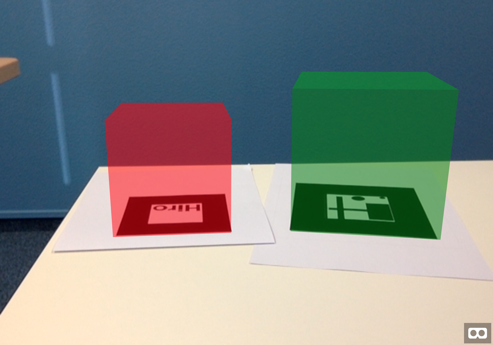

# AR.js demo

## Run

Try it out here: https://renuo.github.io/arjs-demo/

To run it locally, you may need to run it in a web server, e.g.:

```sh
python -m SimpleHTTPServer
```

Open the page and hold the [hiro pattern](https://jeromeetienne.github.io/AR.js/data/images/HIRO.jpg) and the
[custom pattern](custom-pattern.png) into the camera.




## Resources
- https://github.com/jeromeetienne/AR.js/
- https://medium.com/arjs/augmented-reality-in-10-lines-of-html-4e193ea9fdbf
- Create custom patterns:
  https://jeromeetienne.github.io/AR.js/three.js/examples/marker-training/examples/generator.html
- How to use custom patterns:
  https://github.com/jeromeetienne/AR.js/issues/164#issuecomment-332065686

